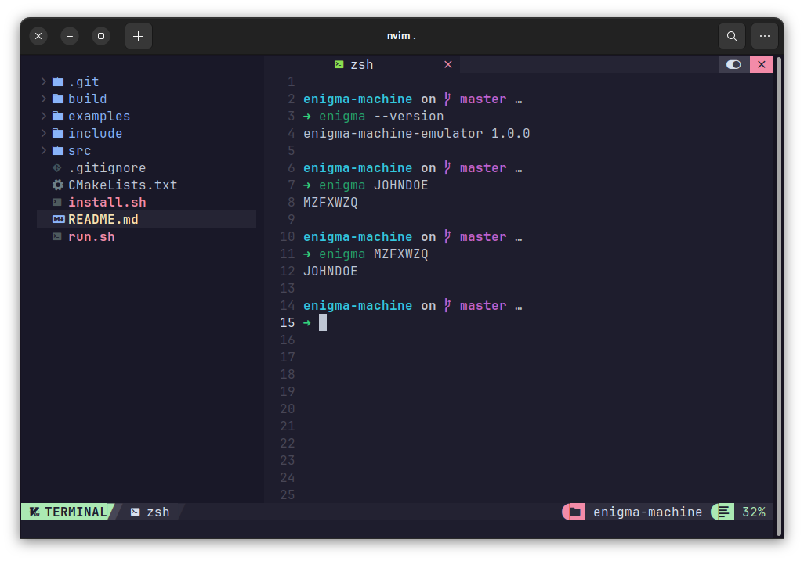

# Enigma Machine Emulator

Enigma Machine Emulator intended to be submitted a task on Information and Network Security (IFC31B3) course.

## Installing Enigma CLI

Clone the repository:

```bash
git clone git@github.com:fzl-22/enigma-machine-emulator.git
```

Navigate to the directory:

```bash
cd enigma-machine-emulator
```

This `enigma` CLI can be easily installed by executing the install script. First, elevate the permission of `install.sh`.

```bash
chmod u+x install.sh
```

Then, execute the install script:

```bash
./install.sh
```

Note that this installation script is still only worked on GNU/Linux. The Windows installation script is yet to come soon. You can check the installation status by executing this command:

```bash
enigma --version
```

## Run the Enigma CLI

Enigma CLI can be used in this format:

```bash
enigma JOHNDOE
```

Then, the output will be:

```
MZFXWZQ
```

To decipher it, just run the same command with the ciphered text:

```bash
enigma MZFXWZQ
```

Then, the output will be:

```
JOHNDOE
```

## Screenshot


